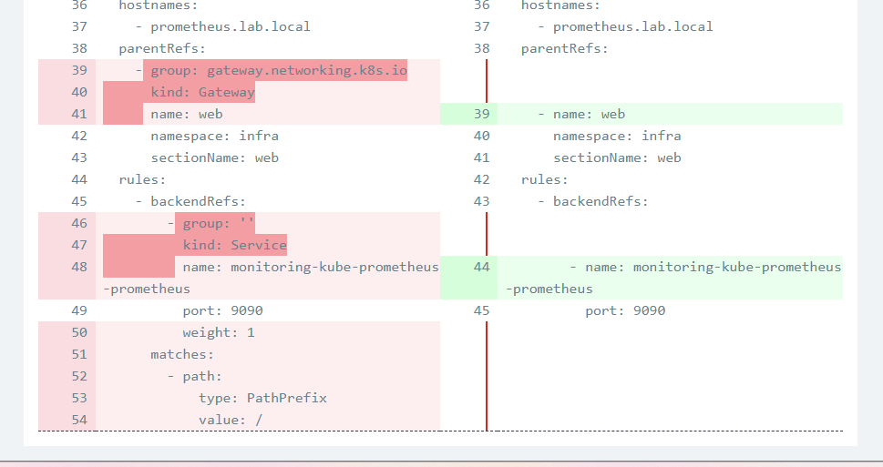

### Lấy argo cd deploy prometheus xong nó báo Too long: may not be more than 262144 bytes

Nó là câu hỏi 13. Thằng kubectl nó lưu lại cái file yaml lần cuối apply ở kubernetes.io/last-applied-configuration. 

|    |    |
|----|----|
|Last Applied|Manifest lần apply trước (annotation)|
|Live Object|Object hiện đang trong etcd|
|New Manifest|File YAML mới|

Vấn đề liền xảy ra khi field anotation giới hạn có 256KB. Rồi thằng nào mà tạo nhiều quá bị báo lỗi.

Kết luận là xài luôn server-side apply từ đầu luôn cho khỏe

### sao nó lại diff

cái httproute này nó lại báo diff với mấy field mặc định. chỉ có grafana và prometheus bị thôi. Khó hiểu dữ.

https://github.com/prometheus-community/helm-charts/issues/6441
Oh có vẻ lỗi thư viện à. Cái này chịu rồi.

Thử xong thì không phải lỗi thư viện, mà là template của prometheus bắt phải ghi như vậy.

Đã xong, dùng server-side apply thì phải bỏ vào thêm mấy cái field default nữa. Client-Side Apply thì lại không dính.

Mà khi lên server-side rồi cái field managed-fields nó cắn luôn không nhả. nên vẫn diff dù đã trả về client-side. phải xóa luôn cho nó tạo lại.