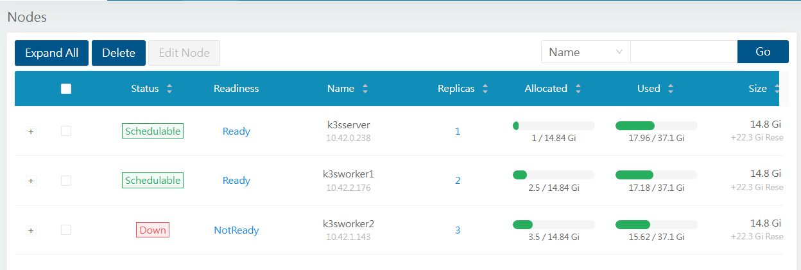
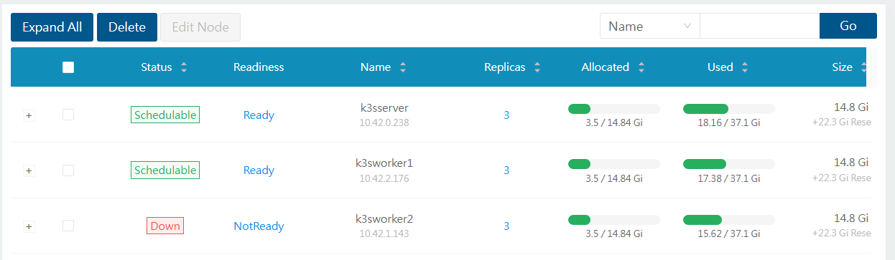
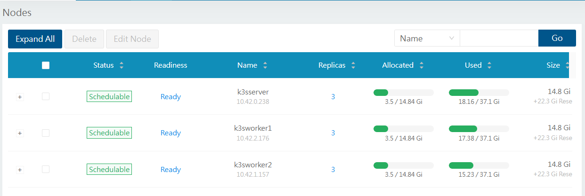
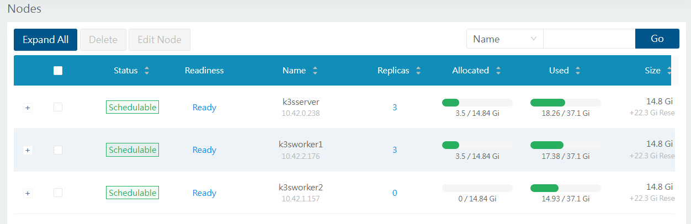

### Thiếu ngủ lại bị dính cái vụ values của chart phụ thuộc phải lấy tên làm biến để đặt. Cái prometheus lại không ăn values.yaml

sửa lại thành kube-prometheus-stack là xong. Và nhớ trước khi làm gì thì helm template trước để coi có ăn hay chưa?

---

### để trong value là defaultReplicaCount: 1 lại không ăn?

```
  defaultSettings:
    defaultReplicaCount: 1
```
Nó là default thôi cái thằng kind storage class lại đẩy lên 3. Phải set lại

```
  persistence:
    defaultClassReplicaCount: 1
```

Mà sửa lại từ 3 thành 1 rồi nhưng cái volume đã tạo thì nó không sửa.

Hỏi chatgpt thì phải chỉnh tay trên UI hoặc CRD do nó sợ mất dữ liệu. Mà thay đổi kiểu gì nó cũng không thèm sửa luôn.

### Sửa cái storage class trong spec để đổi thành 1-2 replica thì nó lại báo không được?
thằng PVC nó immutable rồi, phải tắt cái pod đi thì nó mới cho xóa hoặc đổi. trước khi xóa phải scale về 0 cái.

Giờ phải xóa cho nó tạo lại. Nếu muốn cứu dữ liệu thì backup xong restore thành volume mới.
Hoặc Snapshot rồi Clone. Khá giống AWS.

Mà có dữ liệu gì đâu, xóa luôn cho lẹ.

### xóa xong cho cái pvc nó tạo lại thì grafana hết login được dù có lấy mật khẩu trong secret hay reset

```
kubectl exec -it monitoring-grafana-68f4f8ddbf-4gg5z -n monitoring -- grafana cli admin reset-admin-password 'matkhaucuatoi'
```

Giải quyết bằng cách restart luôn cho khỏe? khỏi debug chi mệt quá.

### Tắt thử worker2 để test longhorn câu hỏi 17. Kết quả app chết sạch :). Vô tình phần lớn app lại nằm trên worker2 mà không có replica trên node khác.

Rất lâu (khoảng 5 phút hơn) app mới phục hồi lại được.



chatgpt kêu xem cấu hình, kiểm tra thì:
replica-auto-balance = disabled
Replica Replenishment Wait Interval = 600

```
kubectl -n longhorn-system get settings.longhorn.io -o wide
```

Sau 10 phút:



Giờ thử mở lại worker2. dung lượng vẫn chiếm.



Nó đã kill 3 cái volume thừa sau vài chục phút. Giờ làm sao cho nó cân bằng lại??? Thôi kệ



