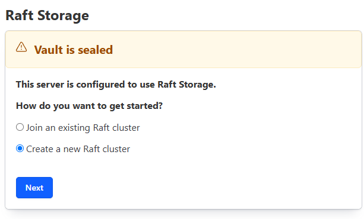

### Lỗi quyền cho external-secret. Hồi qua flow hơi rối lỗi tùm lum.

vault này tưởng là key-value tôi ai dè khá nhiều thứ.

Đầu tiên Secret đơn giản nhất là dùng 

### Tôi để HA 3 rep cho vault xong mỗi pod lại cho 3 rep của longhorn. Cuối cùng ra 9 volume.

                Vault Cluster
         +-----------------------+
         |   Raft Consensus      |
         +-----------------------+
          |         |          |
      vault-0   vault-1   vault-2
          |         |          |
      PVC-0     PVC-1      PVC-2
          |         |          |
    Longhorn  Longhorn   Longhorn

Sơ đồ trên là đủ, mỗi lần ghi dữ liệu là nó ghi vào 3 node luôn.


### lên argocd coi thì pod của vault nó cứ quay quài luôn.

chatgpt kêu phải init và unseal.

```
kubectl exec -it -n vault vault-0 -- vault operator init
```

Nó ra cái đống này, dĩ nhiên là ghi tượng trưng thôi.
```
Unseal Key 1: Og0oqK
Unseal Key 2: r29Vcsr+FnE3e
Unseal Key 3: wken6wguTnoCHnMlSb
Unseal Key 4: yoPxUaViJiFHdJ5KOP3kedmCVN
Unseal Key 5: CxtPO3tA5nSaFrxUVW0aYQYzpLWYRh+N

Initial Root Token: hvs.6szJQ1pNEn
```

Mà chơi qua giao diện nó sẽ bị ngu như bên dưới. Do nó load balance nên tui init pod 1 nó root qua pod 2. 



=> phải dùng cli làm cho xong trên 1 vault-0 cho nó đồng bộ trước.

```
kubectl exec -it -n vault vault-0 -- vault operator init
kubectl exec -it -n vault vault-0 -- vault operator unseal
```

sau đó lại phải unseal 2 cái còn lại. Mỗi cái nhập 3 lần tổng là 9 lần nếu tắt mở lại. Đúng là càng bảo mật càng mệt.

```
kubectl exec -it -n vault vault-1 -- vault operator unseal
kubectl exec -it -n vault vault-2 -- vault operator unseal
```

