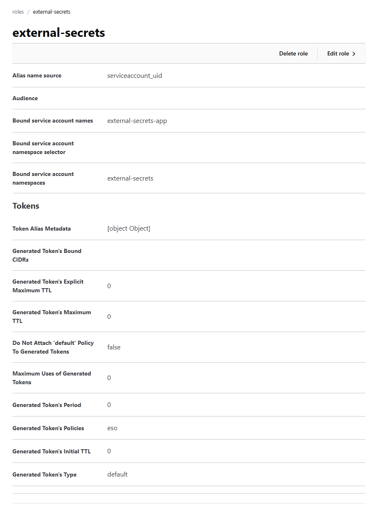

# 8-7-2026

22. LGTM là gộp của 4 công cụ: Loki (log), Grafana (dashboard), Tempo (lưu trace), Mimir(lưu metrics). Cái cuối có thể thay thành Prometheus.

23. 3 trụ cột (3 Pillars) là 
- Metrics: Số liệu CPU, số request, latency.
- Logs: Cái này dễ hiểu rồi khỏi nói.
- Traces: Theo dấu đường đi của request qua nhiều service. Hồi đó thấy có thằng x-ray của AWS rồi.
=> Người ta gọi chung là telemetry.

24. Lịch sử như sau
- Đời đầu 2012–2016 là ELK Stack (**Log là vua chúa**): Ưu điểm là enterprise, nhược điểm cũng là enterprise. Đời đầu viết bằng Java, ngốn RAM kinh khủng. Luồng là 
Application -> Log File -> Logstash -> Elasticsearch ->Kibana

- 2016–2018 Prometheus nhảy lên. Người ta muốn biết thêm CPU, RAM, request. Hay còn gọi là metrics. Luồng là Exporter -> Prometheus -> Grafana

- Giai đoạn tiếp theo, Trace ra đời. Jaeger và Zipkin xuất hiện. Người ta muốn biết request đi qua mấy service (Chắc do microservice). 
=> sinh ra Distributed Tracing.

- Giai đoạn kế, Grafana bắt đầu thấy khó chịu: Tại sao lại phải xài nhiều tools của nhiều bên vậy, thằng Kibana bên ELK chiếm RAM quá trớn.
=> Đẻ ra log collection của riêng mình là Loki. 

- Giai đoạn kế, lại là thằng Grafana thấy mình làm được 2 thứ rồi sao lại không làm hết => Tempo ra đời cho trace.

- Giai đoạn 6 (OpenTelemetry): Sau khi 1 đống tools nhảy ra để làm 3 cái là lưu log, lưu metrics, lưu trace. Rồi người ta còn custom metrics, trace bằng code nữa. Mỗi thằng lại có 1 SDK và code 1 kiểu, mỗi lần đổi là viết lại chết mợ luôn => Đẻ ra thằng OpenTelemetry để chuẩn hóa lại. Chỉ 1 code duy nhất và OpenTelemetry sẽ xử lý đống còn lại, gửi đi đâu là chuyện của nó.

- Giai đoạn 7 (Grafana Alloy): Mỗi thằng tools  Telemetry lại phải cài 1 agent lên máy. metrics có Prometheus, trace thì OTel Collector, log thì Promtail. Sao chúng ta không dùng 1 agent để gom thôi? Tao giới thiệu Alloy nè.

25. Nhìn chung thì cái telemetry này đều có 1 flow chung. Flow đi từ
- Application: Là mấy cái chương trình đang chạy cần theo dõi.
- Producer: Là cái chổ sinh ra telemetry, code sinh log, code sinh trace. Hoặc phần mềm ngồi đọc chỉ số cpu, ram này nọ.
- Collector: Là cái thằng agent hay chương trình gom đống telemetry đó để đem đi.
- Backend: là cái chương trình có database nhận telemetry do Collector gửi tới.
- Dashboard: Là cái chổ vẽ cái telemetry cho mình coi. Lấy dữ liệu từ Backend.
 

26. Phân tích xong rồi tôi chọn:
- Producer: 
    - Metrics: Prometheus node exporte và mấy cái có sẵn
    - Logs: thì có sẵn rồi khỏi nói. stdout, stderr á.
    - Trace: OpenTelemetry SDK
- Collector: 
    - Metrics: OpenTelemetry Collector thay cho prometheus collector. 
    - Logs: OpenTelemetry Collector luôn.
    - Trace: OpenTelemetry Collector luôn.
- Backend: 
    - Metrics: Prometheus luôn có sẵn thì xài. 
    - Logs: Chọn Loki của grafana.
    - Trace: Tempo của grafana.
- dashboard: Là grafana cho toàn bộ cho khỏe.

Suy nghĩ 1 hồi thì có mấy lựa chọn như fluent bit cho log, Alloy của grafana cho collector có vẻ ngon, đồ toàn của grafana thôi chắc đồng bộ lắm. 

Nhưng mà OpenTelemetry có vẻ bự hơn. cái Otel SDK chuẩn CNCF gì đó. 

---

# 6-7-2026

18. init là khởi tạo cái Master key để mã hóa toàn bộ dữ liệu. Rồi tại Root token. cái này 
hình như phải làm thủ công cho an toàn.

Rồi cái seal mới mệt. Mỗi khi khởi động lại nó khóa bằng Master key(private key) nên mở bằng Unseal Keys.

Root key là key để login tài khoản root của vault.

19. Câu này hơi... nhức đầu rồi. 
Đầu tiên nó sẽ có cái external-secrets. Yep, 1 cái app mới nữa đó. Nó sẽ có nhiệm vụ là lụm secret của mấy nhà cung cấp và bỏ vào secret của k8s.

20. Chatgpt nói nhiều cách.

| Giải pháp | Cách hoạt động | Secret có nằm trong Kubernetes Secret không? | Khi nào dùng |
|------------|----------------|----------------------------------------------|---------------|
| **External Secrets Operator (ESO)** | Đồng bộ secret từ Vault/AWS/Azure/GCP vào Kubernetes Secret | ✅ Có | Phổ biến nhất, tương thích với hầu hết ứng dụng |
| **Secrets Store CSI Driver** | Mount secret trực tiếp vào Pod dưới dạng file thông qua CSI Volume | ❌ Không (mặc định) | Muốn tránh lưu secret trong etcd, ứng dụng có thể đọc từ file |
| **Vault Agent Injector** | Inject sidecar Vault Agent để lấy secret từ Vault và ghi vào shared volume | ❌ Không | Chỉ dùng với Vault, phù hợp khi cần Dynamic Secrets hoặc tự động renew secret |
| **Vault Secrets Operator (VSO)** | Operator chính thức của HashiCorp đồng bộ secret từ Vault vào Kubernetes Secret | ✅ Có | Hệ thống lấy Vault làm trung tâm, muốn dùng giải pháp chính chủ của HashiCorp |

**Vậy tính ra mỗi cách độ bảo mật với độ tiện lợi sẽ khác nhau. Thôi cái gì tiện thì mình làm.**

21. Backup thì là cái recurringJob của longhorn. kind recurringJob. 
    - tạo job xong gắn vào volume. cách này khá dể sửa, nhưng không có stable.
    - hoặc gắn thẳng vào storage_class luôn. Cách này siêu stable riết muốn đổi cũng khó.
    - Tạo cái minio(s3 local) bên ngoài rồi cho nó connect tới là được.

## Từ Incident

### nói qua về cái Vault

1. Đầu tiên secret engine
- KV: đơn giản là key-value
- Dynamic Secret Engine: Kiểu vault nó đứng ra làm trung gian, khi cần thì nó sẽ cấp password và tự remove vậy. 
    - Cái này nhìn có vẻ xin. Như database đi. Cấp cho nó tài khoản để tạo được user. Mỗi khi cần đăng nhập nó tự tạo user rồi password hạn trong 1 tiếng. Xong thì nó tự xóa luôn. 
    - Đọc xong thấy ok nhưng phải để ý cái tài khoản đưa cho vault á. an toàn không? Rồi lại quay lại câu chuyện bảo mật cho vault :)

2. Resilience and recovery
- Cái này là để seal lại vault hoặc backup(bản trả phí)

3. Access control:
- Chổ này là RBAC nè. Để coi nó có Access control, Authentication, Organization.
    - Access control: chứa policy đơn giản là
    ```
    path "kv/data/minio" {
        capabilities = ["read"]
    }
    ```
    - Authentication: Auth method thì nó hỗ trợ rất nhiều. rồi còn có 2FA,3FA này nọ. rồi OIDC luôn (SSO à), nice. 
    - Auth này vừa để đăng nhập giao diện với lấy secret này nọ luôn.
    - Organization: group để chia quyền chắc vậy. 

### Cái cơ chế của External Secrets Operator (ESO).

1. Đầu tiên nó sẽ cần 1 cái secret store ở bên ngoài đã. Trong trường hợp này là vault nằm trong cluster.
    - Cần 1 thằng ClusterSecretStore để kết nối với chỗ lưu secret bên ngoài. 
    - Muốn kết nối cần xác thực nữa đúng không? trường hợp này dùng cluster luôn. Cần phải tạo kubernetes role bên giao diện của Vault đó.
    
    - Xong rồi điền vào ClusterSecretStore phần provider/auth là xong.
    - Sau đó nó sẽ tạo ra cái Secret của k8s và lưu vô etcd.
    - Nó chỉ ngồi đó đồng bộ thôi chưa làm gì hết.
    - Mà quên cần policy nữa, cũng tạo bên UI luôn.
    ```
    path "kv/data/minio" {
        capabilities = ["read"]
        }

        path "kv/data/minio/*" {
        capabilities = ["read"]
        }

        path "kv/metadata/minio" {
        capabilities = ["read", "list"]
        }
    ```

2. Sau đó app lấy secret k8s ra dùng. Kind là ExternalSecret và móc vào ClusterSecretStore là xong.

---

# 4-7-2026
16. Cấu hình mặc định nó bảo vệ dữ liệu nên cái app coi như mất luôn ô đĩa khi node đó bay màu. Nếu node bay màu luôn thì mất luôn dữ liệu. 

17. Nó sẽ cố phân phối lại replica theo cấu hình của nó `Replica Replenishment Wait Interval = 600`. 

Sau 10 phút thì nó tự đẻ replica mới để khớp cấu hình.

Sau đó tôi bật worker2 lên lại thì nó không xóa cái cũ ngay.

---

# 3-7-2026
14. Giờ đi tới volume. Tôi sẽ tìm hiểu từ trong ra ngoài.
- Đi từ container ra thì có vẻ volume là của pod. vậy là so với docker compose thì pod sẽ là host. Vậy là 1 volume của pod gắn được nhiều container trong nó.
- Giờ đi tới volume đó lưu ở đâu? 
    - emptyDir: trống đó, lưu như cache trên ổ đĩa của node. Có vẻ pod chết nó đi theo. khá giống ebs dạng instance type.
    - hostPath: dạng này xịn hơn xíu, lưu riêng trên Node. Ủa mà vậy là lở cái pod nó nhảy qua Node khác là đi bụi?
    - PVC: chổ khai báo để gắn storage vô? vậy ngoài cái cluster luôn à? 
        - Thằng này trong ngoài đều có luôn.
    - config và secret? cái này giống chổ lấy biến môi trường rồi.

14. Mở rộng thêm giờ đi vô cái PVC. 
- PVC(Persistent Volume Claim) chỉ là cái kind trong etcd thôi. theo gpt thì nó giống đơn xin xử dụng ổ đĩa. 
- Còn ổ đĩa thì là PV(Persistent Volume): nó cũng là object trong etcd luôn. Có vẻ như nó là chổ đăng ký ổ đĩa với k8s.

14. Tiếp tục đây. Vậy ổ đĩa là cái gì? phải tạo trước đúng không? rồi gắn vô cluster sao?
- Nhìn chung nó có thể là Block Storage(SSD, AWS EBS,...) hoặc File Storage như CephFS hoặc thậm chí S3 luôn nếu chơi tà đạo.
- Tạo trước thì không kiểu phải có storage trước. 
- Gắn vô cluster thì phải có CSI driver. nếu là tụi cloud thì có buildin rồi. Còn nếu là NAT hay local thì phải cài thêm.
- Giờ coi như xong và quyết định dùng Longhorn. Nó tạo được volume dùng dung lượng của Node luôn. Có khi nào nó lấy quá trớn không ta?

15. Cài longhorn rồi. Giờ vấn đề argocd lấy values.yaml của chart gốc thì cái values.yaml có đè lên không? Chatgpt nói là merge. Ok.
longhorn có giới hạn nhưng trong values thì nó chỉ cho giới hạn kiểu chừa lại bao nhiêu % cho máy host.

---

# 2-7-2026

12. Giờ lấy mấy cái chính ra mổ xẻ. Đơn giản là nó sẽ có thêm object application và controller reconcile application. 

Nhìn qua CRD thì nó chỉ có 3 cái mới.
kubectl get crd | findstr argoproj.io
applications.argoproj.io
applicationsets.argoproj.io
appprojects.argoproj.io          

À nó có thêm cái UI va API cho tiện thao tác nữa. Vậy chỉ cần quan tâm application thôi. 

Vậy nhiệm vụ của mình cũng chỉ là CRUD cái application. Xong!

13. Có thể chia thành
- Client-Side Apply (CSA): là kubectl nó lấy thông tin từ server và của mình so sánh(Three-way Merge) xong gửi phần thay đổi(PATCH) cho server. Nói chung là nó tính toán rất chi là nhức đầu nên bỏ qua chi tiết. 
- Server-Side Apply (SSA): Sau này người ta thấy cách xài kubectl nó ngu quá nên đẻ ra thằng này. Mà ngu như thế nào thì kệ không tìm hiểu. Đơn giản là giờ kubectl nó quăng cho API tự xử. 
Sau đó tuy là CRUD nó sẽ chia thành.
kubectl replace -> thay thế luôn.
kubectl patch -> chỉ sửa 1 vài field.
kubectl create -> Tạo mới luôn.

---

# 1-7-2026

7. Chắc chia theo:
    - Compute: Pod, ReplicaSet, Deployment, StatefulSet, DaemonSet, Job, CronJob
    - Networking: ingress, Service,...
    - Storage: PersistentVolume
    - Configuration: Secret, ConfigMap,...
    - Security: RBAC, ServiceAccount,...
    - Scheduling: Scheduler
    - Observability: Metrics Server
    - Extensibility: Mấy cái gắn thêm vô.
    - Còn cả nùi nữa mà lười rồi, mốt tính.

8. Chatgpt nói có
    - ReplicationController gần như đã chết?? nghe hơi ...
    - Ingress dần bị gateway api thay.
    - Lúc trước tưởng docker mà giờ nó dùng containerd hay gì rồi
    - Endpoints và EndpointSlice.

9. Mới phát hiện có mấy thằng không có controller như Secret, ConfigMap... nên cái này chắc không xoáy controller nữa. Giờ chắc chia thành object với App.
    - Object nằm trong etcd, nó là chổ lưu thông tin, như cái database thôi. Mới coi thì nó là dạng key-value như NoSQL.
    - Tụi còn lại sẽ đọc Object này để làm việc, còn làm gì thì tùy từng thằng.
    - Mới sửa thành App vì chatgpt nói có mấy cái đâu phải controller như kubelet, API server. Mọi App trong K8s muốn đọc etcd đều phải đi qua thằng API server. 
    - Controller coi như là app có số lượng bự nhất đi, nó đơn giản là ngồi dòm 1 cái key trong etcd liên tục và cập nhật lại cho đúng với trạng thái đang chạy. Ví dụ đang chạy 1 nginx nhưng etcd nói 3 thì thằng controller thấy khác và sửa thành 3.
    - Sau khi vọc 1 hồi thì phát hiện ConfigMap không có controller. Vậy ai ngó nó? Thì ra nó chỉ đơn giản là data lưu trong etcd thôi, thằng nào cần thì đọc không thì thôi. 
    - Nói dài dòng khó hiểu thôi chốt là nó có etcd lưu data và mấy thằng khác thông qua API đọc data đó rồi làm việc.

10. Giờ đi từng khúc nè. lấy cái nginx của tui ra đi.
    - 1. Thằng nào public port ra đây?
        - ChatGPT trả lời siêu nhức đầu, cơ bản là có 1 thằng sẽ mở port trên Node và dẫn request vào trong.
    - 2. Vậy rồi lỡ có nhiều worker thì nó biết đi đâu?
        - Giờ chatGPT mới nói là có loadbalancer. Ok vậy coi như loadbalancer là thằng điều phối từ ngoài vào node đi.
    - 3. Giờ vào trong rồi phải có 1 thằng nào đó đẩy request đi chứ? nginx à? Rồi cái pod chạy nằm bên worker khác tính sao?
        - Thường người ta sẽ có cái Service đứng hứng. Service nó gôm được endpoint của app lại, là mấy cái ip với port á, giống target của loadbalancer. 
        - Rồi thằng kube-proxy sẽ đọc cái object EndpointSlice thằng Service lưu để đẩy request đi đúng vô pod.
    - 4. Tôi đang xài cái gateway API gì đó nó có thêm cái object định nghĩa loại route luôn như httproute,... để cho mấy thằng khác xài.
    - 5. Chatgpt mới nói là thằng kube-proxy nó lại không phải proxy. nó chỉ watch rồi sửa iptables trên máy thôi. Đúng chuẩn nhìn etcd rồi sửa. Nhức nhức cái đầu rồi, cái Service cũng chỉ là object và có thằng controller khác ngó nó mà làm việc. Vậy là mình đụng toàn bộ là mấy cái object trong etcd.

11. Có thể chia là kubectl \<action> \<resource> \<name> \<option>
    - action: get, edit, delete, apply, exec, describe,logs, patch, scale, rollout, top.
    - resource: toàn bộ trong etcd á. gọi cái nào cũng được
    - name: name của cái resource, à có cái events nữa.
    - option: chắc có -A, -o wide, -w, -f là tui xài nhiều.
---

# 30-6-2026

1. K8s là một cục API siêu bự và có khả năng thêm feature siêu dễ để mở rộng.
2. K8s gồm 
    - Cục API bự chà bá.
    - etcd: Database lưu trạng thái của RD resource và này nọ chưa tìm hiểu.
    - RD(resource definition): Định nghĩa resource cho K8s hiểu. Kiểu khai báo class/object á.
    - Controller: là mấy quản lý đăng ký với API là tôi sẽ quản lý resource nào đó. Khi nào nó thay đổi hãy cho tôi biết để hành động.
    - kubelet: là agent trên node để tụi máy thấy nhau.
    - kubectl: là command line để tương tác với API.

3. Kiến trúc tổng thể gồm
    - Cluster là đơn vị bự nhất đầy đủ chức năng. Dĩ nhiên nếu cloud này nọ thì người ta đặt nhiều cluster để dự phòng này nọ.
    - Bên trong cluster có 2 loại máy hay gọi là node(1 máy vật lý hoặc máy ảo). control panel node hoặc worker node.
        - control panel là node điều kiển. tụi controller hay nằm ở đó. 
        - worker là node chạy workload nói nôm na là tụi làm công đưa gì chạy đó. 
    - Pod cứ coi như 1 instance của app đi, để scale á, trong pod có 1 hoặc nhiều container.

4. (trả lời luôn cho 3.1 và 3.2)
    - K8s hoạt động theo kiểu khai báo mong muốn. Cứ nói tôi muốn 3 cái nginx và k8s sẽ tìm cách.
    - Đầu tiên, k8s dĩ nhiên sẽ có bộ controller tiêu chuẩn của nó. Và controller hay app gì đều chạy trên pod hết, controller cũng là 1 app thôi.
    - Thứ 2: kubelet là thằng đặt biệt, nó chạy trên OS chứ không phải trong k8s. 
    - Thứ 3: k8s sẽ có bộ khởi tạo (bootstrap) gồm các controller thiết yếu trước trên control panel node. kubelet là thằng làm việc khởi tạo. Khi controller khác chết thì sẽ có tụi này đảm nhiệm bật lại (cái Deployment hay kubelet cứu tùy loại).

5. Luồng khởi tạo.
    - Đầu tiên là kubelet agent sẽ bootstrap toàn bộ controller cơ bản của k8s lên control panel node. Sau khi xong rồi nó mới thành k8s hoàn chỉnh và nó hoàn toàn tuân theo quy trình khai báo mong muốn. 
    - Thằng đầu tiên lên là etcd, nó là thằng lưu object của cluster dạng key-value thôi. Kiểu Pod thì gồm thuộc tính nào á. Nó là databse không phải controller.
    - Thằng thứ 2 lên là API, nó là thằng duy nhất không phải controller. Nó là thằng giao tiếp trực tiếp với etcd. Mọi controller còn lại thì giao tiếp với nó.
    - Thằng thứ 3 lên là controller thiệt nè, nhưng nó là một bộ controller của K8s gồm Node, Deployment, Namespace,... 
    - Thằng thứ 4 lên là controller kube-scheduler nó chỉ làm 1 việc là chọn node cho pod thôi. Kiểu coi chổ nào trống là điền vô. 

6. Khai báo mong muốn    
    - Flow chung: Desired State (Object) -> API Server -> etcd -> Controller Watch -> Reconcile -> Actual State
    - Thằng controller nào cũng y chang vậy hết. Đầu tiên là khai báo object vô etcd thông qua thằng API rồi thằng controller cũng nói với API là nó muốn theo dõi cái object đó. 
    - Sau đó khi object đó đổi thì thằng API sẽ bắn thông báo tới thằng controller là object mày đăng ký đổi rồi đó và thằng controller sẽ biết và sửa lại cho đúng. Controller chỉ làm 1 việc là so sánh coi trạng thái hiện tại và mong muốn khác không.
    - Ví dụ: ReplicaSet Controller nó sẽ chỉ thông báo với API là: Ê tạo muốn coi cái object ReplicaSet và object Pod á, nó đổi thì nói. Sau đó nó đổi thì API sẽ bắn cho ReplicaSet Controller biết thay đổi và Controller tự sửa lại cho đúng.
    - Giống với tất cả các app khác gắn vô sau này như argocd, rồi log, rồi monitor. Mỗi thằng đều có controller của riêng mình. 
    - **Chốt lại chỉ là một đống controller chạy cùng lúc. Mỗi controller đều theo cùng một pattern (Watch → Reconcile). Cuối cùng thành ra học controller chứ không phải K8s, mỗi thằng chạy 1 kiểu**.

